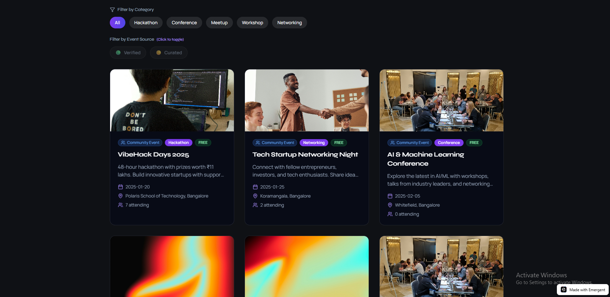
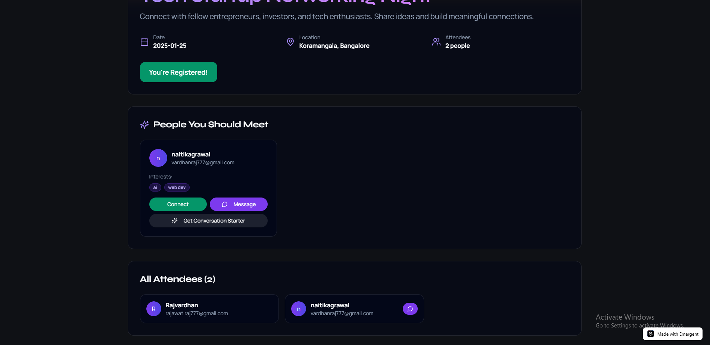
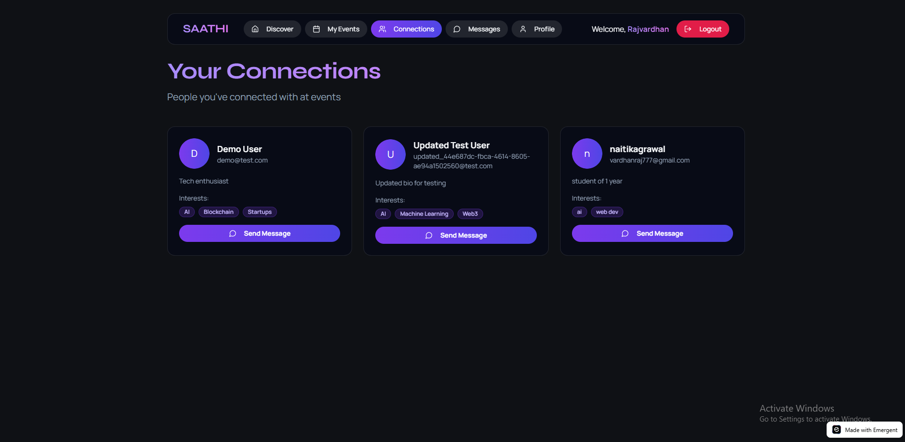
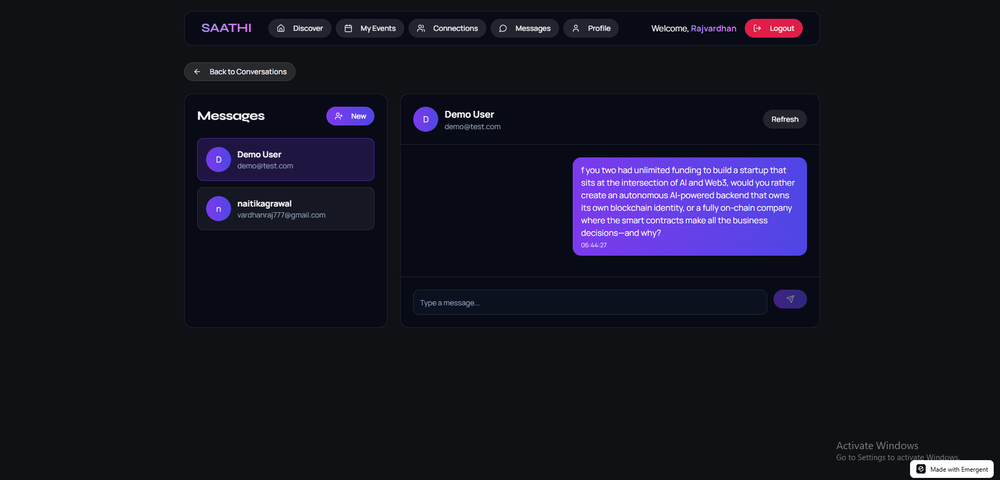
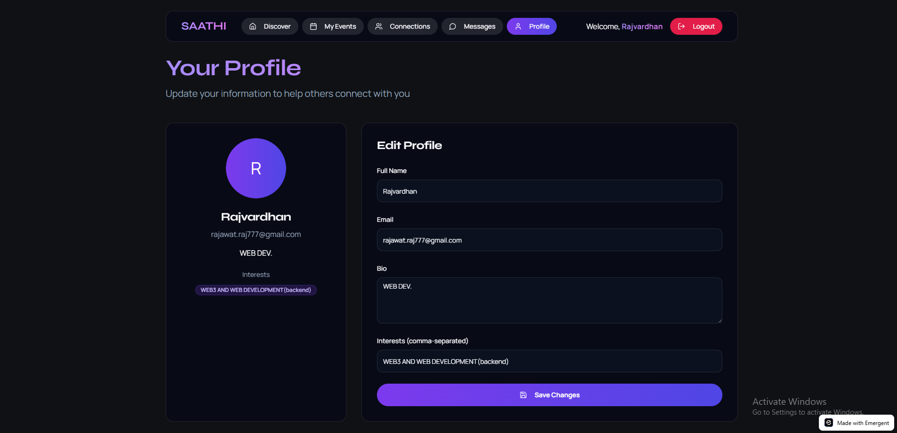
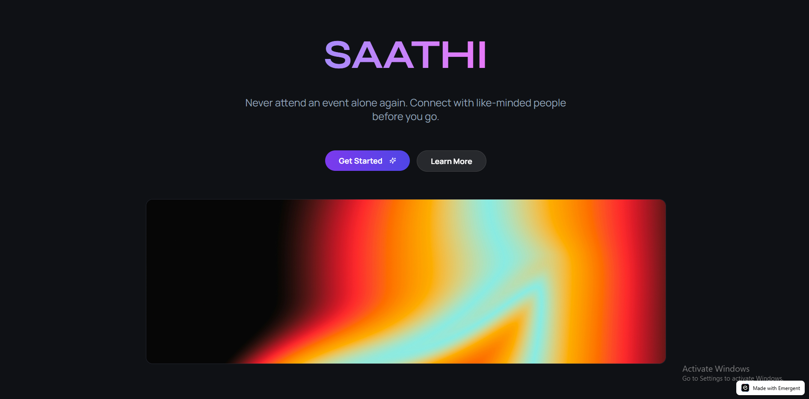

# EventSaathi 🤝

EventSaathi is a platform designed to help people attend events together instead of going alone.

## Problem
Many people hesitate to attend events alone due to social anxiety or fear of feeling isolated. As a result, they miss out on valuable opportunities to learn, network, and grow.

## Solution
EventSaathi helps users find like-minded people who are attending the same event, so they can connect beforehand and go together.

## Features
- Discover people attending similar events  
- Connect with potential event partners  
- Simple and clean user flow  
- Focus on reducing hesitation and improving participation  

## Screenshots

### Discover

### Match

### Chat

### Profile

### Dashboard

## Build
This is an early-stage prototype built to explore the idea and user experience.

## Note
Currently in prototype stage. The concept and flow are demonstrated through the UI.

## Author
Rajvardhan Singh Rajawat
